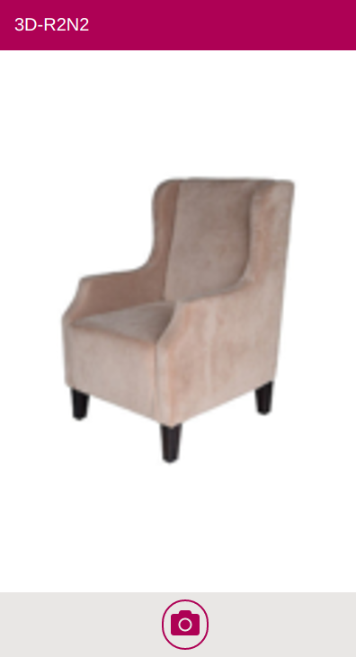

# 3D-R<sup>2</sup>N<sup>2</sup>: 3D Recurrent Reconstruction Neural Network

## Overview

This project is a fork of an implementation of 3D-R2N2 from the paper [Choy et al., 3D-R2N2: A Unified Approach for Single and Multi-view 3D Object Reconstruction, ECCV 2016](http://arxiv.org/abs/1604.00449).
Given one or multiple views of an object, the network generates voxelized ( a voxel is the 3D equivalent of a pixel) reconstruction of the object in 3D.

A demo by the authors can be seen at: http://3d-r2n2.stanford.edu/viewer/

Original repo: https://github.com/chrischoy/3D-R2N2

Additionally this repo contains an Vue.js frontend, optimized for mobile usage to capture images on the go and view a server-side generated 3D model, which can display the result right on the mobile device via WebGL.

## Interface

| Capturing images            | Generated Model Viewer       |
|:---------------------------:|:----------------------------:|
|  |  |

## Getting started

The project consists of three components, the python 3D-R2N2 implementation, a python web-server and a Vue.js frontend.

### Installation

#### Server

We recommend that you install Python 3.7 with the virtual-environment package. We assume you are using a debian based linux.

```shell script
sudo apt install python3.7 python3.7-venv -y
```

Clone the repo

```shell script
git clone https://github.com/KIDICA/3D-R2N2.git
```

Install required modules and components.

```shell script
python3.7 -m venv venv
source venv/bin/activate
pip install -r requirements.txt
```
##### Datasets

We used [ShapeNet](http://shapenet.cs.stanford.edu) models to generate rendered images and voxelized models which are available below (you can follow the installation instruction below to extract it to the default directory).

* ShapeNet rendered images [http://cvgl.stanford.edu/data2/ShapeNetRendering.tgz](http://cvgl.stanford.edu/data2/ShapeNetRendering.tgz)
* ShapeNet voxelized models [http://cvgl.stanford.edu/data2/ShapeNetVox32.tgz](http://cvgl.stanford.edu/data2/ShapeNetVox32.tgz)
* Trained ResidualGRUNet Weights [http://cvgl.stanford.edu/data2/ResidualGRUNet.npy](http://cvgl.stanford.edu/data2/ResidualGRUNet.npy)

##### Starting the server.

```shell script
python server.py
```

Now you can open in your browser: http://localhost:8000

##### Run the demo

##### Running demo.py

Install meshlab (skip if you have another mesh viewer). If you skip this step, demo code will not visualize the final prediction.

```shell script
sudo apt-get install meshlab
```

- Run the demo code and save the final 3D reconstruction to a mesh file named `prediction.obj`

```shell script
python demo.py prediction.obj
```

### Training the network

For details on this section please refer to the original repo, this is only a summary.

Activate the virtual environment before you run the experiments.

```
source py3/bin/activate
```

Download datasets and place them in a folder named `ShapeNet`

```
mkdir ShapeNet/
wget http://cvgl.stanford.edu/data2/ShapeNetRendering.tgz
wget http://cvgl.stanford.edu/data2/ShapeNetVox32.tgz
tar -xzf ShapeNetRendering.tgz -C ShapeNet/
tar -xzf ShapeNetVox32.tgz -C ShapeNet/
```

- Train and test the network using the training shell script

```
./experiments/script/res_gru_net.sh
```

**Note**: The initial compilation might take awhile if you run the theano for the first time due to various compilations. The problem will not persist for the subsequent runs.

#### Client/Frontend

The frontend is a Vue.js application which is entirely separated from the server.

##### Development

```shell script
cd client
npm install 
npm run serve
```

Will provide you will a link to a live recompile entry point.

##### Deployment

This will just deploy the Vue application to app/dist which is statically served by the Python server.

```shell script
cd client
npm run build
```

# TODOs

Although the model is trained on a large 3D data-set it still not practical to get consistent results from everyday objects. Most of the time you will only get a semi-noise cube, which indicates an unsuccessful approximation to any known object. 

1. Try/train other 3D data-sets for better performance. Notice that using an custom data-set is not that trivial (see original paper about this issue).
1. Provide multi-client use (currently one user is assumed).
1. Allow sending model to a 3D printer from the mobile device.

# Reference

```
@inproceedings{choy20163d,
  title={3D-R2N2: A Unified Approach for Single and Multi-view 3D Object Reconstruction},
  author={Choy, Christopher B and Xu, Danfei and Gwak, JunYoung and Chen, Kevin and Savarese, Silvio},
  booktitle = {Proceedings of the European Conference on Computer Vision ({ECCV})},
  year={2016}
}
```

## Original Project Page

The project page is available at [http://cvgl.stanford.edu/3d-r2n2/](http://cvgl.stanford.edu/3d-r2n2/).